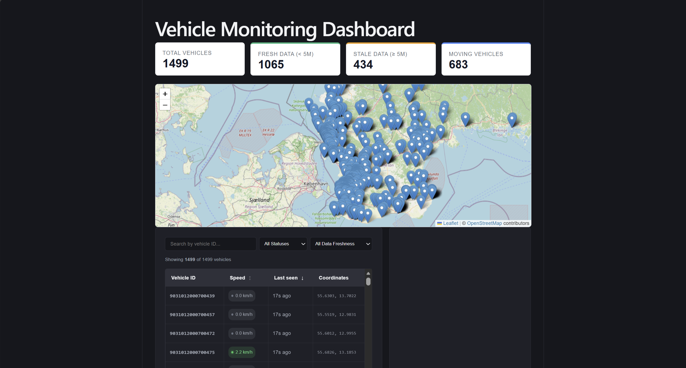
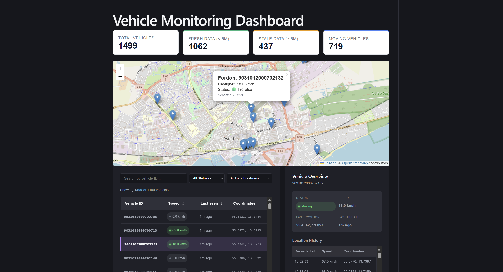

# End-to-End Data Engineering Pipeline

[](https://github.com/nat15hol/end-to-end-data-engineering-pipeline/actions)
[](https://github.com/nat15hol/end-to-end-data-engineering-pipeline/blob/main/LICENSE)
[](https://www.python.org/)
[](https://www.getdbt.com/)
[](https://www.docker.com/)

# Overview

This project demonstrates the design and implementation of an end-to-end data engineering pipeline using modern data engineering practices.

The goal is to demonstrate a complete data workflow where data is collected from an external source, stored, transformed, validated, exposed through an API, and consumed through an interactive dashboard.

## Project Status

| Component | Status |
| --- | --- |
| Data ingestion | ✅ Implemented |
| Airflow orchestration | ✅ Implemented |
| dbt transformations | ✅ Implemented |
| API | ✅ Implemented |
| Dashboard | ✅ Implemented |
| CI validation | ✅ Implemented |
| Production deployment (CD) | ⏳ Not implemented |

The project covers:

- Data ingestion from external APIs
- Workflow orchestration using Apache Airflow
- Data storage and management using PostgreSQL
- Data transformation using dbt
- Data quality validation
- Automated testing
- Analytical data modeling
- API development
- Interactive dashboard development
- Containerized development environment
- Continuous Integration
- Version control and documentation practices

---

# Architecture Overview

```text
Trafiklab GTFS-RT API
        |
        v
Python Data Ingestion
        |
        v
PostgreSQL Raw Layer
(raw_vehicle_positions)
        |
        v
dbt Transformations
        |
        v
Analytical Data Models
(dim_vehicle,
 fact_vehicle_positions,
 fact_vehicle_activity,
 fact_vehicle_latest_position)
        |
        v
FastAPI Backend
        |
        v
React + TypeScript Dashboard
        |
        +--> Vehicle Monitoring Table
        +--> KPI Overview
        +--> Interactive Vehicle Map
        +--> Vehicle History
```

The architecture separates data collection, storage, transformation, serving, and visualization into distinct layers.

The pipeline is orchestrated using Apache Airflow, with the following task sequence:

```text
run_ingestion
        |
        v
dbt_run
        |
        v
dbt_test
```

Schedule:

```python
schedule = "*/2 * * * *"
```

The DAG is configured with shared `default_args` (retries and retry delay), so a transient failure in any task does not require manual intervention before the next scheduled run.

---

# Reliability

The ingestion client includes retry logic with exponential backoff, handling HTTP 429 and 5xx responses from the Trafiklab API, along with structured logging around ingestion requests and failures. Airflow DAG-level retries (via shared `default_args`) mean a transient task failure does not require manual intervention before the next scheduled run.

Data quality and software quality are validated through dbt tests and the CI workflow (see [Testing](#testing)).

---

# Technology Stack

| Area | Technology |
| --- | --- |
| Programming | Python |
| Backend API | FastAPI |
| Frontend | React + TypeScript |
| Orchestration | Apache Airflow |
| Containerization | Docker & Docker Compose |
| Database | PostgreSQL |
| Transformation | dbt |
| Data Quality | dbt Tests (`not_null`, `unique`, `relationships`) |
| Automated Testing | pytest |
| Security Scanning | pip-audit |
| Mapping | Leaflet |
| Version Control | Git & GitHub |
| Project Management | GitHub Projects |
| Continuous Integration | GitHub Actions |

---

# Getting Started

## Prerequisites

- Docker Desktop & Docker Compose
- Python 3.12+
- Node.js 22+

## 1. Clone the repository

```bash
git clone https://github.com/nat15hol/end-to-end-data-engineering-pipeline.git
cd end-to-end-data-engineering-pipeline
```

## 2. Configure environment variables

```bash
cp .env.example .env
```

```dotenv
POSTGRES_USER=your_username
POSTGRES_PASSWORD=your_password
POSTGRES_DB=your_database
POSTGRES_HOST=localhost
POSTGRES_PORT=5432

TRAFIKLAB_API_KEY=your_api_key_here
```

When running services directly on the host, use `localhost:5432`. Inside Docker Compose, services reach PostgreSQL via the service name, `postgres:5432`.

## 3. Configure the dbt profile

dbt requires `dbt/profiles.yml` to connect to PostgreSQL. This file is git-ignored and is not included in the repository, so it must be created locally — without it, `dbt run` / `dbt test`, and therefore the Airflow `dbt_run` task, cannot connect to the database.

Create `dbt/profiles.yml`:

```yaml
data_pipeline:
  target: dev
  outputs:
    dev:
      type: postgres
      host: "{{ env_var('POSTGRES_HOST') }}"
      user: "{{ env_var('POSTGRES_USER') }}"
      password: "{{ env_var('POSTGRES_PASSWORD') }}"
      port: "{{ env_var('POSTGRES_PORT') | as_number }}"
      dbname: "{{ env_var('POSTGRES_DB') }}"
      schema: public
      threads: 4
```

Adjust the profile name/target to match `dbt/dbt_project.yml` if it differs.

## 4. Start PostgreSQL and Airflow

```bash
docker compose build
docker compose up -d
```

| Service | URL |
| --- | --- |
| Apache Airflow Webserver | http://localhost:8080 |
| PostgreSQL Database | localhost:5432 |

Default credentials in `docker-compose.yml` are for local development only. Change them and use a secrets management solution for any shared or production environment.

## 5. Run the FastAPI backend

```bash
cd api
pip install -r ../requirements.txt
uvicorn main:app --reload
```

API: http://localhost:8000 — Swagger docs: http://localhost:8000/docs

## 6. Run the React dashboard

```bash
cd frontend
npm install
npm run dev
```

Dashboard: http://localhost:5173

---

# Project Structure

```text
end-to-end-data-engineering-pipeline/

├── .github/
│   └── workflows/
│
├── airflow/
│   └── dags/
│
├── api/
│   ├── main.py
│   ├── models.py
│   └── queries.py
│
├── dbt/
│   ├── models/
│   │   ├── staging/
│   │   └── marts/
│   ├── dbt_project.yml
│   └── profiles.yml        # local file only, not committed — see "Getting Started", step 3
│
├── frontend/
│   └── src/
│
├── src/
│   ├── ingestion/
│   └── database/
│
├── tests/
│
├── docs/
│
├── docker-compose.yml
├── requirements.txt
├── .env.example
└── README.md
```

---

# Implemented Pipeline

1. Airflow triggers the ingestion process.
2. Python retrieves vehicle position data from Trafiklab GTFS-RT.
3. Vehicle position data is stored in PostgreSQL.
4. dbt transforms raw data into analytical models.
5. dbt tests validate the transformed data.
6. FastAPI exposes analytical vehicle data through REST endpoints.
7. React consumes the API and provides an interactive monitoring dashboard.

Implemented dbt models:

- `stg_vehicle_positions`
- `fact_vehicle_positions`
- `fact_vehicle_activity`
- `fact_vehicle_latest_position` — powers the `/vehicles/latest` endpoint
- `dim_vehicle`

---

# Data Layers

## Raw Layer

```text
raw_vehicle_positions
```

Contains ingested vehicle position observations from Trafiklab GTFS-RT.

## Analytics Layer

```text
stg_vehicle_positions
fact_vehicle_positions
fact_vehicle_activity
fact_vehicle_latest_position
dim_vehicle
```

---

# API Layer

| Endpoint | Description |
| --- | --- |
| `GET /` | Health check |
| `GET /vehicles/latest` | Latest known position per vehicle (reads `fact_vehicle_latest_position`) |
| `GET /vehicles/{vehicle_id}/history` | Full position history for one vehicle (reads `fact_vehicle_positions`) |

The API acts as a bridge between the analytical database layer and the React dashboard. Swagger documentation is available at `/docs`.

---

# Dashboard

The React + TypeScript dashboard provides:

- Vehicle monitoring table
- Vehicle search by ID
- Vehicle status filtering
- Data freshness monitoring
- Moving / idle vehicle classification
- Interactive vehicle map (Leaflet)
- KPI overview
- Vehicle selection between map and table
- Automatic scrolling to selected vehicles
- Historical vehicle position analysis

```text
Fresh Data: < 5 minutes
Stale Data: >= 5 minutes
```

This threshold aligns with the pipeline execution frequency.

---

# Dashboard Preview



The dashboard supports interaction between the vehicle table and map view. Selecting a vehicle highlights the corresponding row and updates the map position.



---

# Testing

## Automated Tests

```bash
pytest
```

The test suite covers ingestion transformation logic and API endpoints.

```text
5 passed
``` The database layer is mocked using `monkeypatch`, so these tests run without a live PostgreSQL instance.

## Data Quality Tests

dbt tests (`not_null`, `unique`, `relationships`) validate the analytical models and are executed in the CI workflow:

```bash
cd dbt
dbt test --profiles-dir .
```

## Continuous Integration

The GitHub Actions workflow runs on every push and pull request targeting `main`, and covers:

- **Backend** — automated `pytest` suite, Python compilation checks, `pip-audit` dependency scanning
- **Frontend** — linting and production build
- **dbt** — `dbt debug`, `dbt run`, and `dbt test` against a live PostgreSQL service container
- **Docker** — validation and build of the Docker Compose stack

---

# Documentation

- [Project Plan](docs/project_plan.md)
- [Delivery Process](docs/delivery_process.md)
- [Verification Test Report](docs/verification-test.md)
- [System Architecture](docs/system_architecture.md)
- [Data Model](docs/data_model.md)
- [CI Documentation](docs/ci-cd.md)

---

# Future Improvements

- Full automated pipeline execution testing
- Browser-based end-to-end testing
- Advanced dashboard analytics
- Event-driven streaming architecture
- Additional data sources
- Enhanced data quality checks (freshness checks, anomaly detection)
- Automated metadata generation
- Alerting on Airflow task failures
- Cloud-based production deployment (CD)

---

# Author

**Henrik Oldehed**

Data Engineer | Analytics Specialist

GitHub: https://github.com/nat15hol

LinkedIn: https://www.linkedin.com/in/henrikoldehed/

Portfolio project demonstrating modern Data Engineering practices.