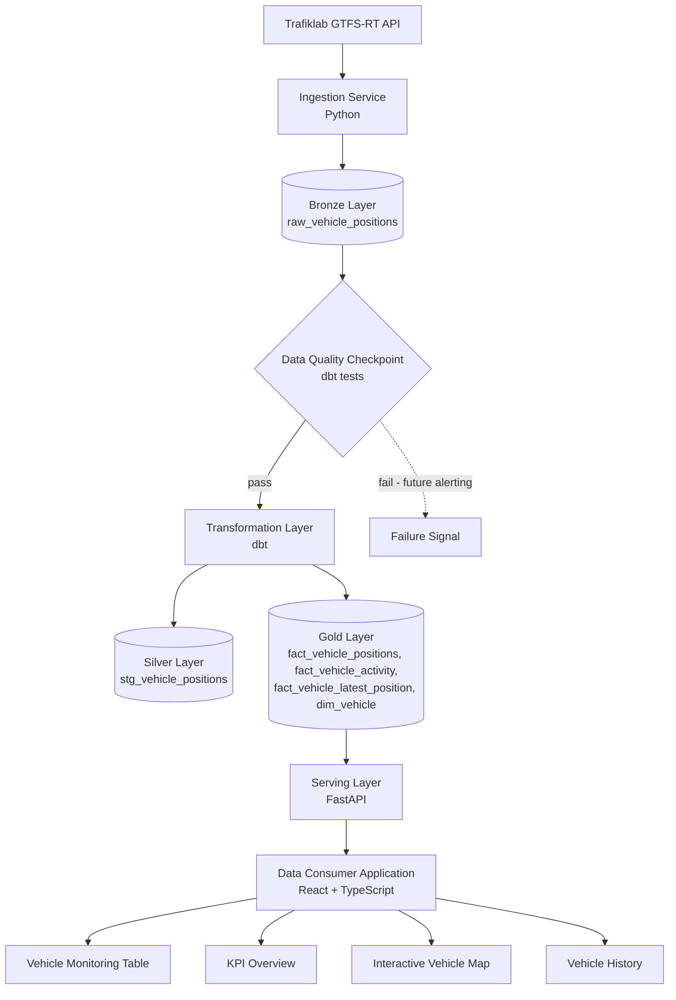
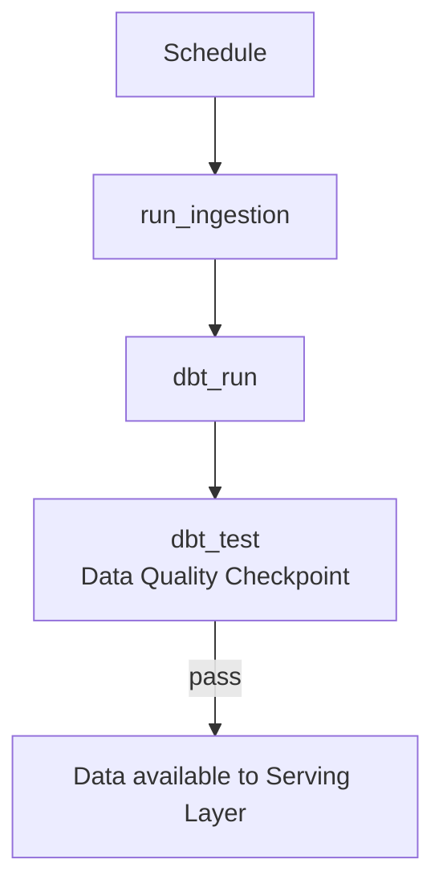
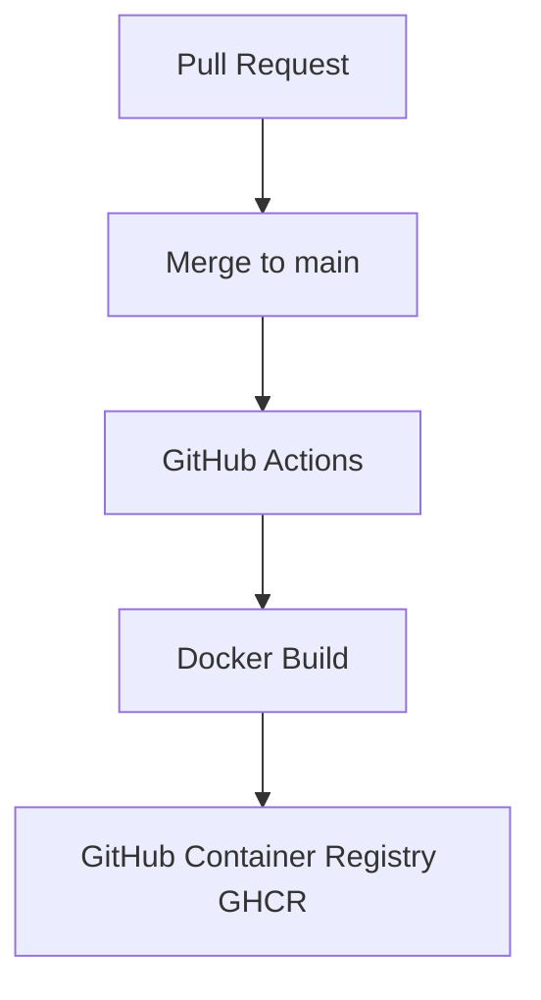

# End-to-End Data Engineering Pipeline

[](https://github.com/nat15hol/end-to-end-data-engineering-pipeline/actions)
[](https://github.com/nat15hol/end-to-end-data-engineering-pipeline/blob/main/LICENSE)
[](https://www.python.org/)
[](https://www.getdbt.com/)
[](https://www.docker.com/)

## Table of Contents

- [Overview](#overview)
  - [Project Status](#project-status)
- [Architecture Overview](#architecture-overview)
- [Reliability and Observability](#reliability-and-observability)
- [Technology Stack](#technology-stack)
- [Getting Started](#getting-started)
- [Project Structure](#project-structure)
- [Implemented Pipeline](#implemented-pipeline)
- [Data Layers](#data-layers)
- [Serving Layer](#serving-layer)
- [Data Consumer Application](#data-consumer-application)
- [Dashboard Preview](#dashboard-preview)
- [Testing](#testing)
- [Container Image Publishing (CD)](#container-image-publishing-cd)
- [Documentation](#documentation)
- [Future Improvements](#future-improvements)
- [Author](#author)

---

## Overview

This project demonstrates production-inspired data engineering patterns: reliable ingestion, structured transformations, data quality validation, and a dedicated serving layer for analytical consumption.

Data is collected from an external source, ingested into a raw ingestion layer (Bronze layer), transformed and quality-validated through dbt into Silver and Gold analytical models, exposed through a serving API, and consumed through an interactive monitoring dashboard.

### Project Status

| Component | Status |
| --- | --- |
| Data ingestion | ✅ Implemented |
| Airflow orchestration | ✅ Implemented |
| dbt transformations | ✅ Implemented |
| Serving API | ✅ Implemented |
| Data consumer application (dashboard) | ✅ Implemented |
| CI validation | ✅ Implemented |
| Container image publishing (GHCR) | ✅ Implemented |
| Cloud deployment | ⏳ Not implemented |

The project covers:

- Data ingestion from external APIs
- Workflow orchestration using Apache Airflow
- Data storage and management using PostgreSQL
- Data transformation using dbt (Bronze → Silver → Gold)
- Data quality validation checks
- Automated testing
- Analytical data modeling
- Serving layer (API) development
- Data consumer application (interactive dashboard) development
- Containerized development environment
- Continuous Integration and Continuous Delivery
- Version control and documentation practices

---

## Architecture Overview



The pipeline is organized into distinct layers: an ingestion boundary that isolates the external API from the rest of the system, a Bronze/Silver/Gold data layering built with dbt, a data quality checkpoint, and a serving layer that decouples the analytical data model from the consumer application.

The dashed path above (`Quality -.-> Alert`) reflects current design intent, not a built feature — failure alerting is not yet implemented (see [Reliability and Observability](#reliability-and-observability) and [Future Improvements](#future-improvements)).

The pipeline is orchestrated using Apache Airflow, with the following task sequence:



Schedule:

```python
schedule = "*/2 * * * *"
```

The DAG is configured with shared `default_args` (retries and retry delay), so a transient failure in any task does not require manual intervention before the next scheduled run.

---

## Reliability and Observability

### Reliability

The ingestion client includes retry logic with exponential backoff, handling HTTP 429 and 5xx responses from the Trafiklab API, along with structured logging around ingestion requests and failures. Airflow's shared `default_args` (see [Architecture Overview](#architecture-overview)) mean a transient task failure does not require manual intervention before the next scheduled run.

Data quality and software quality are validated through dbt tests and the CI workflow (see [Testing](#testing)).

### Observability

| Signal | Status |
| --- | --- |
| Airflow task monitoring (via Airflow UI) | ✅ Implemented |
| dbt test results as a quality checkpoint | ✅ Implemented |
| Structured ingestion logging | ✅ Implemented |
| Data freshness indicator (dashboard-level) | ✅ Implemented |
| Pipeline-level freshness checks | ⏳ Not implemented |
| Failure alerting | ⏳ Not implemented |
| Data lineage | ⏳ Not implemented |

This distinction intentionally separates implemented functionality from future improvements.

---

## Technology Stack

| Area | Technology |
| --- | --- |
| Programming | Python |
| Backend API | FastAPI |
| Frontend | React + TypeScript |
| Orchestration | Apache Airflow |
| Containerization | Docker & Docker Compose |
| Database | PostgreSQL |
| Transformation | dbt |
| Data Quality | dbt Tests (`not_null`, `unique`, `relationships`) |
| Automated Testing | pytest |
| Security Scanning | pip-audit |
| Mapping | Leaflet |
| Version Control | Git & GitHub |
| Project Management | GitHub Projects |
| Continuous Integration (CI) | GitHub Actions — tests, linting, dbt tests, security scanning |
| Continuous Delivery (CD) | GitHub Actions — container image build & publish to GHCR |

---

## Getting Started

### Prerequisites

- Docker Desktop & Docker Compose
- Python 3.12+
- Node.js 22+

### 1. Clone the repository

```bash
git clone https://github.com/nat15hol/end-to-end-data-engineering-pipeline.git
cd end-to-end-data-engineering-pipeline
```

### 2. Configure environment variables

```bash
cp .env.example .env
```

```dotenv
POSTGRES_USER=your_username
POSTGRES_PASSWORD=your_password
POSTGRES_DB=your_database
POSTGRES_HOST=localhost
POSTGRES_PORT=5432

TRAFIKLAB_API_KEY=your_api_key_here
```

When running services directly on the host, use `localhost:5432`. Inside Docker Compose, services reach PostgreSQL via the service name, `postgres:5432`.

### 3. Configure the dbt profile

dbt requires `dbt/profiles.yml` to connect to PostgreSQL. This file is git-ignored and is not included in the repository, so it must be created locally — without it, `dbt run` / `dbt test`, and therefore the Airflow `dbt_run` task, cannot connect to the database.

Create `dbt/profiles.yml`:

```yaml
data_pipeline:
  target: dev
  outputs:
    dev:
      type: postgres
      host: "{{ env_var('POSTGRES_HOST') }}"
      user: "{{ env_var('POSTGRES_USER') }}"
      password: "{{ env_var('POSTGRES_PASSWORD') }}"
      port: "{{ env_var('POSTGRES_PORT') | as_number }}"
      dbname: "{{ env_var('POSTGRES_DB') }}"
      schema: public
      threads: 4
```

Adjust the profile name/target to match `dbt/dbt_project.yml` if it differs.

### 4. Start PostgreSQL and Airflow

```bash
docker compose build
docker compose up -d
```

| Service | URL |
| --- | --- |
| Apache Airflow Webserver | http://localhost:8080 |
| PostgreSQL Database | localhost:5432 |

Default credentials in `docker-compose.yml` are for local development only. Change them and use a secrets management solution for any shared or production environment.

### 5. Run the FastAPI backend

```bash
cd api
pip install -r ../requirements.txt
uvicorn main:app --reload
```

API: http://localhost:8000 — Swagger docs: http://localhost:8000/docs

### 6. Run the React dashboard

```bash
cd frontend
npm install
npm run dev
```

Dashboard: http://localhost:5173

---

## Project Structure

```text
end-to-end-data-engineering-pipeline/

├── .github/
│   └── workflows/
│
├── airflow/
│   └── dags/
│
├── api/
│   ├── main.py
│   ├── models.py
│   └── queries.py
│
├── dbt/
│   ├── models/
│   │   ├── staging/
│   │   └── marts/
│   ├── dbt_project.yml
│   └── profiles.yml.example   # template; copy to profiles.yml locally
│
├── frontend/
│   └── src/
│
├── src/
│   ├── ingestion/
│   └── database/
│
├── tests/
│
├── docs/
│
├── docker-compose.yml
├── requirements.txt
├── .env.example
└── README.md
```

---

## Implemented Pipeline

1. Airflow triggers the ingestion process.
2. Python retrieves vehicle position data from Trafiklab GTFS-RT.
3. Vehicle position data is stored in the PostgreSQL raw ingestion layer (Bronze layer).
4. dbt transforms raw data into Silver/Gold analytical models.
5. A data quality checkpoint (dbt tests) validates the transformed data before downstream availability.
6. FastAPI exposes the Gold-layer analytical models as a serving layer via REST endpoints.
7. The data consumer application (React) consumes the serving layer and provides an interactive monitoring dashboard.

Implemented dbt models:

- `stg_vehicle_positions`
- `fact_vehicle_positions`
- `fact_vehicle_activity`
- `fact_vehicle_latest_position` — powers the `/vehicles/latest` endpoint
- `dim_vehicle`

---

## Data Layers

The project follows a Bronze/Silver/Gold layering, built with dbt on top of PostgreSQL. The underlying dbt object names use the `stg_`/`fact_`/`dim_` convention, aligned with a medallion architecture pattern.

### Bronze Layer (Raw Ingestion)

```text
raw_vehicle_positions
```

Contains ingested vehicle position observations from Trafiklab GTFS-RT, written by the ingestion service before any transformation or validation.

### Silver Layer (Staging)

```text
stg_vehicle_positions
```

Cleaned and standardized staging model built on top of the Bronze layer via dbt.

### Gold Layer (Marts)

```text
fact_vehicle_positions
fact_vehicle_activity
fact_vehicle_latest_position
dim_vehicle
```

Analytical fact and dimension models, validated by dbt tests, that feed the [Serving Layer](#serving-layer).

---

## Serving Layer

| Endpoint | Description |
| --- | --- |
| `GET /` | Health check |
| `GET /vehicles/latest` | Latest known position per vehicle (reads `fact_vehicle_latest_position`) |
| `GET /vehicles/{vehicle_id}/history` | Full position history for one vehicle (reads `fact_vehicle_positions`) |

The serving layer exposes the Gold-layer analytical models through a REST API built with FastAPI, decoupling the analytical database layer from the data consumer application. Swagger documentation is available at `/docs`.

---

## Data Consumer Application

The data consumer application is a React + TypeScript dashboard demonstrating operational analytics consumption from transformed vehicle telemetry data. It provides:

- Vehicle monitoring table
- Vehicle search by ID
- Vehicle status filtering
- Data freshness monitoring
- Moving / idle vehicle classification
- Interactive vehicle map (Leaflet)
- KPI overview
- Vehicle selection between map and table
- Automatic scrolling to selected vehicles
- Historical vehicle position analysis

```text
Fresh Data: < 5 minutes
Stale Data: >= 5 minutes
```

This threshold aligns with the pipeline execution frequency.

---

## Dashboard Preview


The dashboard supports interaction between the vehicle table and map view. Selecting a vehicle highlights the corresponding row and updates the map position.


---

## Testing

### Automated Tests

```bash
pytest
```

The automated test suite covers ingestion transformation logic and API endpoints.

```text
5 passed
```

The database layer is mocked using `monkeypatch`, so these tests do not require a live PostgreSQL connection.

### Data Quality Tests

dbt tests (`not_null`, `unique`, `relationships`) validate the analytical models and are executed in the CI workflow:

```bash
cd dbt
dbt test --profiles-dir .
```

### Continuous Integration

This is the Continuous Integration (CI) half of the pipeline — validation on every push and pull request. The Continuous Delivery (CD) half — building and publishing the container image — is covered under [Container Image Publishing (CD)](#container-image-publishing-cd).

The GitHub Actions workflow runs on every push and pull request targeting `main`, and covers:

- **Backend** — automated `pytest` suite, Python compilation checks, `pip-audit` dependency scanning
- **Frontend** — linting and production build
- **dbt** — `dbt debug`, `dbt run`, and `dbt test` against a live PostgreSQL service container
- **Docker** — validation and build of the Docker Compose stack

---

## Container Image Publishing (CD)

A GitHub Actions workflow automatically builds and publishes the Airflow Docker
image to GitHub Container Registry (GHCR) when changes are pushed to `main`.

The workflow:

- Builds the Airflow Docker image from `docker/airflow/Dockerfile`
- Tags the image with both `latest` and the commit SHA
- Publishes the image to GitHub Container Registry



The published image is available at:

```text
ghcr.io/nat15hol/airflow-pipeline
```

This container image is intended as a deployment artifact for a future cloud deployment step (see [Future Improvements](#future-improvements)).

---

## Documentation

- [Project Plan](docs/project_plan.md)
- [Delivery Process](docs/delivery_process.md)
- [Verification Test Report](docs/verification-test.md)
- [System Architecture](docs/system_architecture.md)
- [Data Model](docs/data_model.md)
- [CI Documentation](docs/ci.md)
- [Known Limitations](docs/known-limitations.md)
- [Technical Review (2026-07)](docs/reviews/technical-review-2026-07.md)

---

## Future Improvements

- Full automated pipeline execution testing
- Browser-based end-to-end testing
- Advanced dashboard analytics
- Event-driven streaming architecture
- Additional data sources
- Enhanced data quality checks (freshness checks, anomaly detection)
- Data lineage visibility
- Automated metadata generation
- Alerting on Airflow task failures
- Cloud deployment of the published GHCR container image (Azure/AWS/other)

---

## Author

**Henrik Oldehed**

Data Engineer | Analytics Specialist

GitHub: https://github.com/nat15hol

LinkedIn: https://www.linkedin.com/in/henrikoldehed/

Data engineering project covering ingestion, transformation, data quality validation, analytical modeling, and API-based data consumption.