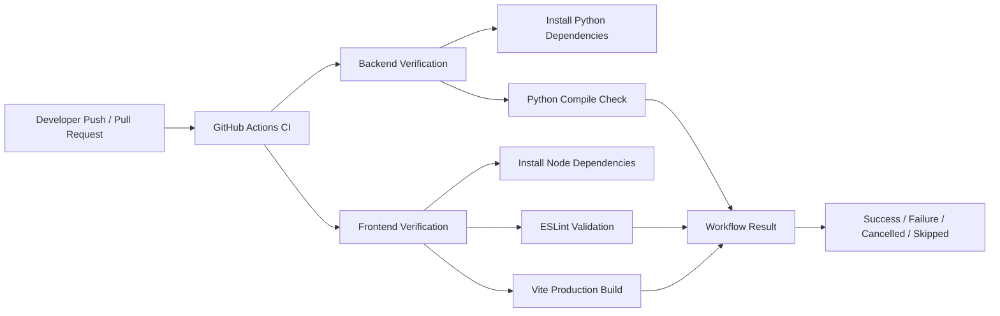
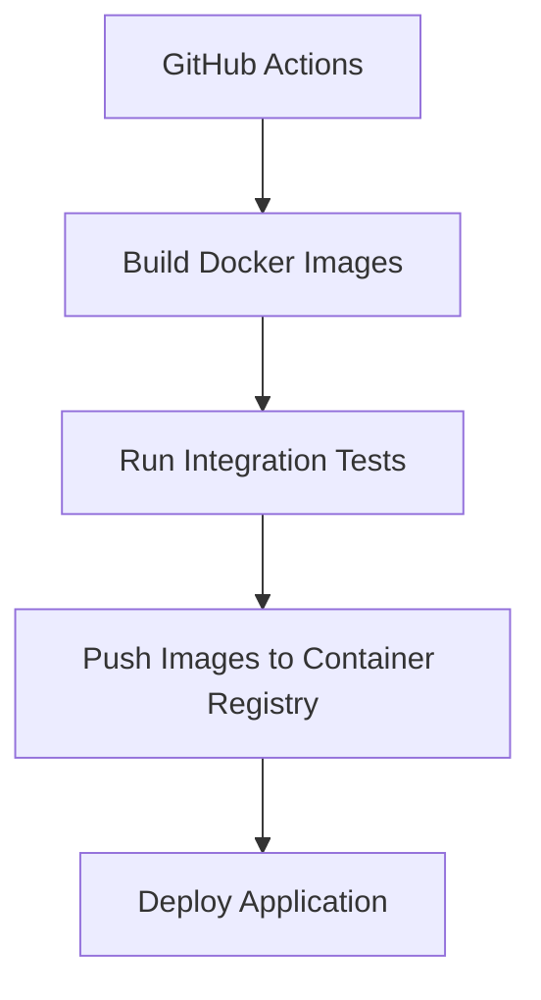

# CI Documentation

## Purpose

This document describes the Continuous Integration (CI) pipeline implemented for the Fleet Intelligence project.

The purpose of the CI pipeline is to automatically verify code quality, syntax, and buildability on every push and pull request targeting the `main` branch.

The project currently implements Continuous Integration (CI) using GitHub Actions. Continuous Deployment (CD) is not implemented at this stage.

---

## Pipeline Architecture

The CI workflow is triggered automatically when:

- Code is pushed to the `main` branch
- A pull request is created targeting the `main` branch



The workflow validates both backend and frontend components before changes are merged into the `main` branch.

The workflow configuration is located at:

```text
.github/workflows/ci.yml
```

---

## Implemented CI Checks

### 1. Backend Verification

The backend CI job verifies that the Python application can be installed and validated successfully.

**Install Dependencies**

```bash
pip install -r requirements.txt
```

This confirms that all required Python dependencies can be installed in the CI environment.

**Python Validation**

```bash
python -m compileall api src
```

This checks that Python source files compile successfully and detects syntax errors before changes are merged.

### 2. Frontend Verification

The frontend CI job validates the React + TypeScript application.

**Install Dependencies**

```bash
npm ci
```

This installs the exact dependency versions defined in `package-lock.json`.

**Code Quality Validation**

```bash
npm run lint
```

ESLint verifies:

- Code quality
- React and TypeScript consistency
- Potential code issues

**Production Build Verification**

```bash
npm run build
```

This confirms that the frontend application can successfully compile into a production-ready build using Vite.

---

## CI Status

| Component                         | Status    |
|------------------------------------|-----------|
| GitHub Actions workflow           | Completed |
| Backend dependency installation   | Completed |
| Python validation                 | Completed |
| Frontend dependency installation  | Completed |
| ESLint validation                 | Completed |
| Frontend production build         | Completed |

---

## Local Validation

The same checks executed by GitHub Actions can be run locally before pushing changes.

**Backend Validation**

```bash
python -m compileall api src
```

**Frontend Validation**

```bash
cd frontend
npm ci
npm run lint
npm run build
```

Running these checks locally helps detect issues before they reach the CI pipeline.

---

## Scope and Limitations

The current implementation focuses on Continuous Integration. Continuous Deployment is intentionally not included because the application currently runs in a local Docker Compose environment.

**Implemented:**

- Automated dependency installation
- Backend validation
- Frontend linting
- Frontend production build verification
- Automated GitHub Actions workflow execution

**Not implemented:**

- Automated Docker image publishing
- Container registry integration
- Cloud deployment
- Production environment deployment
- Automated releases

---

## Future Improvements

Possible future automation improvements include:



Future enhancements could include:

- Database test environment
- Extended security scanning
- Docker build verification
- Continuous Deployment workflow for production environments

---

## Conclusion

The Fleet Intelligence project currently has a working Continuous Integration pipeline using GitHub Actions.

The CI workflow automatically verifies that backend and frontend changes can be installed, validated, and built successfully before being merged into the `main` branch. This provides automated quality control and establishes a foundation for future Continuous Deployment improvements.