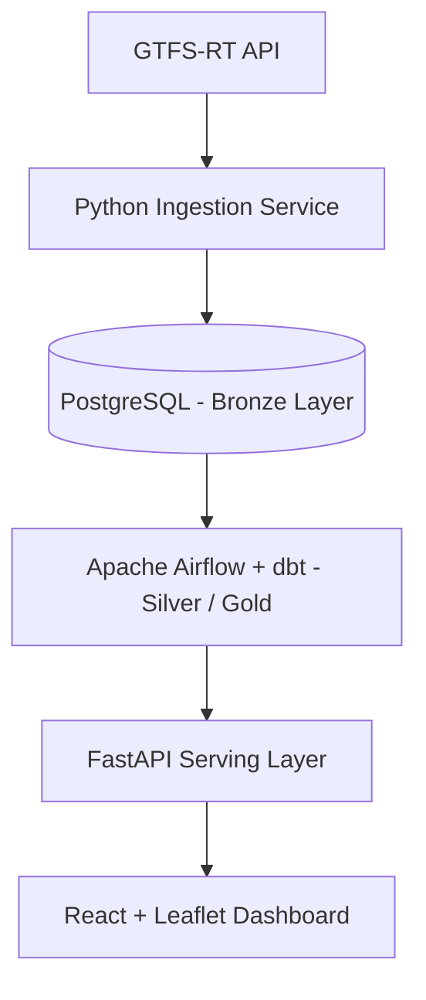
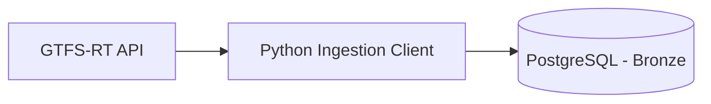
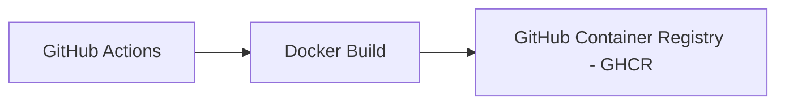

# 📄 Project Report & Development History – GTFS-RT Pipeline

> **Project:** End-to-End Data Engineering Pipeline (GTFS-RT Skånetrafiken)  
> **Author:** Henrik Oldehed (nat15hol)  
> **Period:** July 19 – August 2, 2026  
> **Status:** Technical Milestone v1.0 (Production-Like Prototype with CI/CD)  
> **Document Type:** Engineering Case Study  
> **Repository:** nat15hol/airflow-pipeline  
> **Release:** v1.0  

---

## 📌 Executive Summary

This project covers the development of an end-to-end data engineering pipeline for collecting, processing, quality-assuring, and visualizing real-time public transit data from Skånetrafiken's GTFS Realtime API.

The project evolved incrementally from an initial architecture and development setup into a data pipeline featuring automated data ingestion, transformation, API exposure, and interactive visualization.

The final architecture covers the complete data lifecycle:

The project demonstrates modern data engineering principles through:

* Modular architecture
* Layered data modeling (Bronze/Silver/Gold - Medallion Architecture)
* Data quality assurance and validation
* Automated testing
* CI/CD automation
* Containerization
* Documented system design

---

## 🛠️ Technical Overview

| Domain | Technology | Purpose |
| :--- | :--- | :--- |
| **Data Source** | Skånetrafiken GTFS Realtime API | Real-time vehicle position telemetry |
| **Programming** | Python 3.12 | Ingestion, backend, and core application logic |
| **Database** | PostgreSQL | Raw data storage and analytical models |
| **Orchestration** | Apache Airflow | Pipeline scheduling and workflow execution |
| **Transformation** | dbt | Data transformation, modeling, and quality tests |
| **Backend** | FastAPI | REST API serving layer |
| **Frontend** | React + TypeScript | Interactive operational dashboard |
| **Visualization** | Leaflet | Map-based spatial vehicle visualization |
| **Containerization** | Docker Compose | Reproducible development environment |
| **CI/CD** | GitHub Actions | Automated verification and delivery workflows |
| **Container Registry** | GHCR | Public container image distribution |
| **Testing** | pytest, httpx, dbt tests | End-to-end quality assurance |

---

## 🏗️ Architecture Overview

The system is structured across the following layers and responsibilities:

| Layer | Component | Responsibility |
| :--- | :--- | :--- |
| **Ingestion** | Python Service (`ingestion/`) | Fetching and parsing raw GTFS-RT Protobuf streams |
| **Bronze** | PostgreSQL (`raw_vehicle_positions`) | Raw, un-flattened historical payloads |
| **Silver** | dbt staging (`stg_vehicle_positions`) | Data cleansing, type casting, and standardization |
| **Gold** | dbt marts (`dim_*`, `fact_*`) | Analytical star schemas and aggregated data models |
| **Serving** | FastAPI (`api/`) | High-performance data access, API endpoints, business logic |
| **Presentation** | React + Leaflet (`frontend/`) | Interactive spatial visualizer and vehicle management interface |

---

## 🗓️ Development Phases

### Phase 1 – Project Initiation & Architecture
**Period: July 19–20, 2026**

The project began by establishing the repository layout, system architecture design, and foundational infrastructure. The objective was to construct a robust environment for rapid iteration.

* **Key Deliverables:**
  * Established modular repository structure
  * Defined multi-tiered data pipeline architecture
  * Documented initial data models
  * Built containerized setup via Docker Compose (`docker-compose.yml`)
  * Configured environment isolation and base templates (`.env.example`)
* **Outcome:** A stable, reproducible development environment ready for ingestion logic.

---

### Phase 2 – Data Ingestion & Database Integration
**Period: July 21–23, 2026**

The initial functional module was developed to integrate directly with Skånetrafiken's GTFS Realtime API.

Data flow established:

* **Implemented:**
  * Vehicle position ingestion service (`ingestion/main.py`, `ingestion/gtfs_client.py`)
  * Integration with Skånetrafiken's Protobuf feed
  * Automated database schema creation and connection pooling
  * Bronze persistence layer (`raw_vehicle_positions`)
  * Base payload validation and exception handling
* **Outcome:** Operational ingestion pipeline continuously capturing live transit telemetry.

---

### Phase 3 – Pipeline, Transformation & Orchestration
**Period: July 24–25, 2026**

An end-to-end data transformation pipeline was introduced using Apache Airflow and dbt.

* **Apache Airflow handles:**
  * DAG scheduling and task orchestration (`dags/vehicle_pipeline_dag.py`)
  * Retries, alerting logic, and execution logs
* **dbt handles:**
  * In-database transformations (`dbt/models/`)
  * Automated data testing (`dbt/tests/`)

#### Implemented dbt Models

##### Silver Layer
* `models/staging/stg_vehicle_positions.sql`: Schema normalization, data sanitization, and type enforcing.

##### Gold Layer
* `models/marts/dim_vehicle.sql`: Vehicle dimension table.
* `models/marts/fact_vehicle_positions.sql`: Historical position event log.
* `models/marts/fact_vehicle_latest_position.sql`: Latest reported position per active vehicle.
* `models/marts/fact_vehicle_activity.sql`: Aggregated vehicle operational analytics.

* **Outcome:** Layered data warehouse modeling following established Medallion Architecture practices.

---

### Phase 4 – API & Visualization Layer
**Period: July 26, 2026**

A dedicated presentation tier was developed to serve analytics and spatial data. An early Streamlit prototype was sunsetted in favor of a production-ready React application.

#### FastAPI Serving Layer (`api/`)
* **Implemented:**
  * REST API endpoints (`api/main.py`, `api/queries.py`)
  * SQLAlchemy ORM database queries (`api/database.py`)
  * Structured exception handling (`HTTPException`)
  * CORS middleware setup and interactive Swagger UI (`/docs`)

#### React Dashboard (`frontend/`)
* **Implemented:**
  * Leaflet map visualizer covering the Skåne transit region
  * Real-time vehicle list with dynamic filter and search
  * Bidirectional map-to-table focus selection
  * Auto-pan and smooth camera navigation to selected vehicles

* **Outcome:** High-performance serving layer and interactive user interface built on top of the analytical data models.

---

### Phase 5 – Quality Assurance, CI/CD & Release
**Period: July 27 – August 2, 2026**

The final phase prioritized system hardening, automated testing, and release packaging.

#### 🚦 Data Quality & Integrity
* **Implemented:**
  * dbt schema quality assertions (`not_null`, `unique`)
  * Hard database constraints: Enforced data integrity via `UNIQUE(vehicle_id, timestamp)` in PostgreSQL to prevent duplicate ingestion records.
  * API input validation and exponential backoff retry algorithms.

#### 🔄 CI/CD Workflows
GitHub Actions automation was built across two core pipelines:
* `.github/workflows/ci.yml`: Runs unit tests (`pytest`), integration tests (`httpx`), frontend build validation, `dbt run`/`dbt test` against an ephemeral Postgres container, and Docker build checks.
* `.github/workflows/publish-ghcr.yml`: Automated pipeline for building and publishing production container images.

#### 📦 Container Distribution
Automated release pipeline:

Published Image:
`ghcr.io/nat15hol/airflow-pipeline`

---

## 🔧 Technical Improvements

### Reliability
* **Implemented:**
  * API retries with exponential backoff inside the ingestion client
  * Airflow DAG retry configuration (`retries=3`, `retry_delay`)
  * Structured logging across backend and ETL steps

### Security
* **Implemented:**
  * Strict environment variable separation (`.env`)
  * Dependabot enabled for security advisory tracking
  * Automated vulnerability scanning for Python dependencies
  * Deterministic dependency locking (`requirements.txt`)

### Documentation
* **Enhanced:**
  * Native Mermaid architecture diagrams in `README.md`
  * CI/CD deployment guide (`docs/ci.md`)
  * System trade-offs and limits (`docs/known-limitations.md`)
  * Full technical system docs and release notes

---

## 📊 Milestones

| Date | Milestone | Outcome |
| :--- | :--- | :--- |
| **July 19–20** | Infrastructure | Repository, architecture design, and Docker setup established |
| **July 21–23** | Ingestion & DB | GTFS-RT integration and PostgreSQL Bronze layer |
| **July 24–25** | Pipeline | Airflow (`vehicle_pipeline_dag.py`) and dbt models running |
| **July 26** | Serving Layer | FastAPI REST API and React + Leaflet dashboard built |
| **July 27–29** | CI/CD | GitHub Actions pipeline established (`ci.yml`) |
| **July 30–31** | Hardening | `UNIQUE` constraints added, backoff retries, GHCR deployment |
| **August 1–2** | Release v1.0 | Final release docs and Mermaid visual diagrams finalized |

---

## 🚀 Release Notes v1.0

**Release Date:** August 2, 2026

* **Data Ingestion:**
  * Skånetrafiken GTFS Realtime feed integration.
  * Continuous ingestion engine with PostgreSQL persistence and deduplication guards.
* **Data Pipeline:**
  * Apache Airflow orchestration driving modular dbt models.
  * Bronze/Silver/Gold data architecture with automated quality assertions.
* **API & Dashboard:**
  * FastAPI REST engine served via Uvicorn.
  * React + TypeScript UI featuring interactive Leaflet mapping over Skåne.
* **DevOps & QA:**
  * GitHub Actions pipelines (`ci.yml`, `publish-ghcr.yml`).
  * Automated Docker build verification, GHCR registry publishing, and Dependabot auditing.

---

## 📈 Project Status

### Implemented
* ✅ GTFS-RT ingestion client
* ✅ PostgreSQL data warehouse (Bronze / Silver / Gold)
* ✅ Airflow orchestration (`dags/vehicle_pipeline_dag.py`)
* ✅ dbt transformation models
* ✅ Automated data quality tests (`dbt test`)
* ✅ FastAPI serving layer (`api/`)
* ✅ React + Leaflet map dashboard (`frontend/`)
* ✅ GitHub Actions CI/CD workflows (`.github/workflows/`)
* ✅ GHCR container registry publishing

### Future Improvements
* ⏳ Cloud infrastructure deployment (e.g., AWS/GCP Kubernetes or Managed Airflow)
* ⏳ System metrics and pipeline observability (Prometheus / Grafana)
* ⏳ Automated pipeline failure alerts (Slack / PagerDuty integration)
* ⏳ Automated data lineage graph generation
* ⏳ Static GTFS data integration (for route names, stops, and schedules)
* ⏳ Advanced historical trend analytics

---

## 🏁 Conclusion

This project successfully delivered a production-like data engineering solution that manages the full lifecycle from raw real-time telemetry ingestion to operational visualization.

Version 1.0 marks a technical milestone combining data engineering, backend architecture, frontend visualization, and modern DevOps practices into a cohesive system. The codebase provides a clean template for building robust, scalable, and verifiable data pipelines.