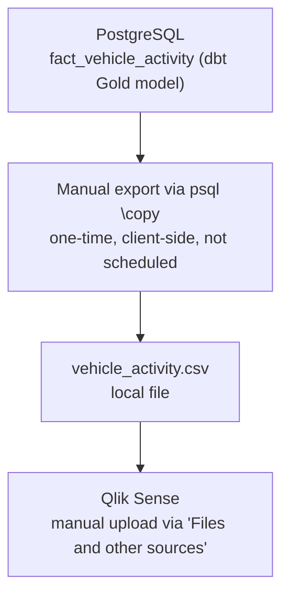
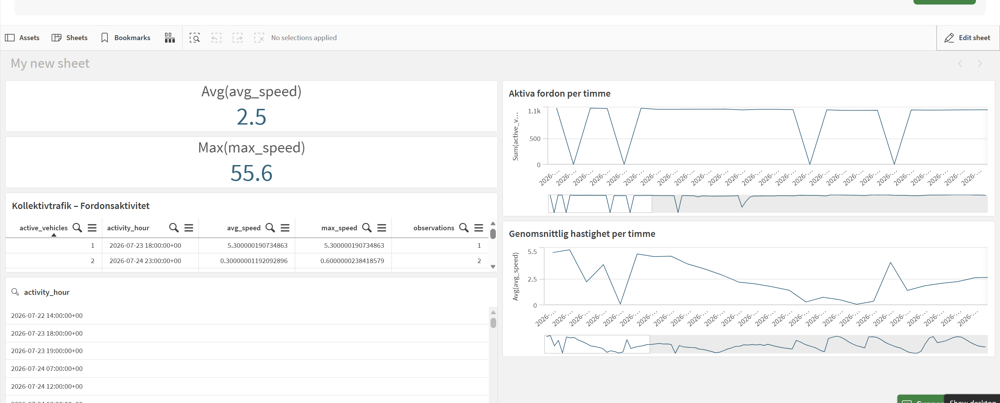
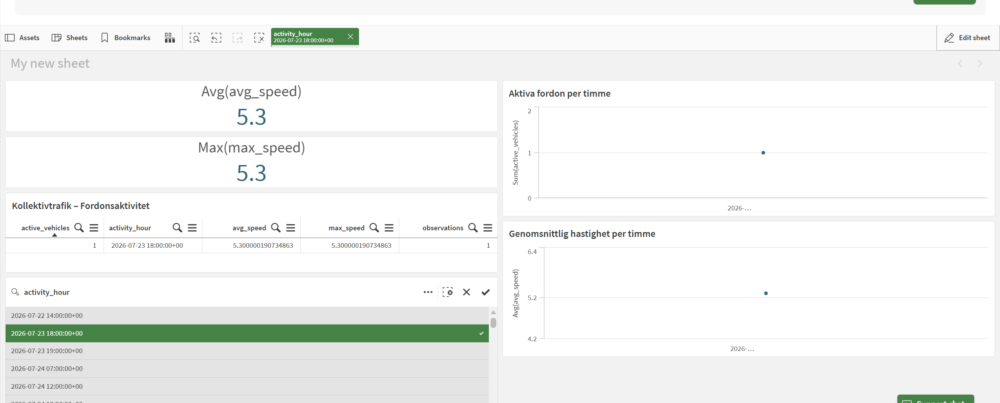

# Qlik Sense Analysis Layer

> **Status:** Prototype / proof-of-concept, built on top of the core pipeline
> **Environment:** Qlik Cloud Analytics (trial)

## Purpose

Alongside the React frontend (real-time vehicle map), this project includes a small
Qlik Sense app used as an aggregated analysis and reporting layer. Where the React
frontend focuses on live, per-vehicle detail, the Qlik app focuses on hourly,
aggregated trends — active vehicle counts and speed patterns over time.

The two are complementary, not redundant:

| Layer | Focus | Granularity |
|---|---|---|
| React frontend | Live vehicle positions on a map | Per-vehicle, real-time |
| Qlik Sense app | Aggregated activity & speed trends | Hourly, aggregated |

## Data flow

The Qlik app is fed by a manual export from the pipeline's Gold layer — it is not
a live or scheduled connection:

`\copy` is psql's client-side variant of `COPY` — it writes the query result straight
to a file on the machine running psql, rather than on the database server. That's
what made a quick local CSV export possible without any server-side file access.

This was a deliberate scope decision: the goal was to evaluate Qlik Sense as an
analysis/reporting tool on top of the existing Gold-layer data, not to build a
production data connection. A direct or scheduled PostgreSQL connection, a custom
load script, and a linked multi-table data model were all considered but left out
of scope.

## What the app contains

A single sheet ("Kollektivtrafik-analys") built directly on `vehicle_activity.csv`,
using standard Qlik Sense objects only:

- 2 KPI objects — average speed, max speed
- 2 line charts — active vehicles per hour, average speed per hour
- 1 straight table — vehicle activity by hour
- 1 filter pane on `activity_hour`, using Qlik's built-in associative filtering

Expressions used (all standard aggregations, no set analysis):

| Object | Expression |
|---|---|
| Average speed (KPI) | `Avg(avg_speed)` |
| Max speed (KPI) | `Max(max_speed)` |
| Active vehicles per hour (chart) | `Sum(active_vehicles)` |
| Average speed per hour (chart) | `Avg(avg_speed)` |

Selecting a value in the filter pane updates the KPIs, table, and both charts —
demonstrating Qlik's associative model.

## Screenshots

*Full sheet, no selections applied.*

*A selection on `activity_hour` propagating to the KPIs, table, and charts.*

## Scope and limitations

Kept intentionally simple, given the time available and the goal of demonstrating
core Qlik Sense functionality on top of an existing pipeline:

- No live or scheduled connection to PostgreSQL — data is a one-time manual export.
- No custom load script — CSV fields were parsed automatically on upload.
- No set analysis, master items, or section access.
- No map visualization in Qlik — that lives in the React frontend.
- Single flat table, no multi-table data model.

## Relation to the rest of the pipeline

This app consumes the same Gold-layer model (`fact_vehicle_activity`) that the
serving API and dashboard are built on — see [`data_model.md`](data_model.md) and
the main [README](../README.md#data-layers) for how that model is produced.